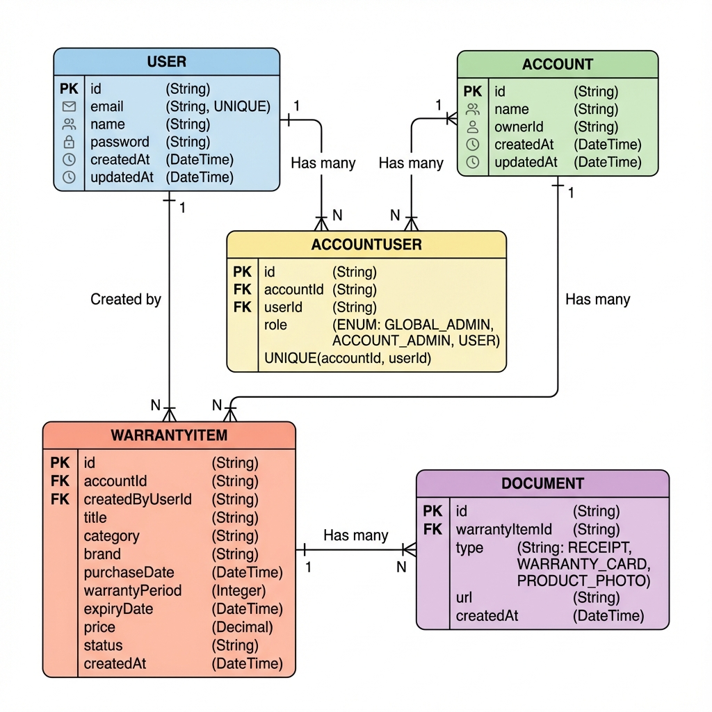

# Warranty Manager
## Система за управление на гаранции

**Атанас Димитров**

Университетски проект - Бази данни

---

# ER Диаграма



---

# Обща информация

**Цел на проекта:**
Уеб приложение за управление на гаранции, касови бележки и продуктова документация

**Технологии:**
- PostgreSQL (релационна база данни)
- Prisma ORM
- Next.js 16
- NextAuth v5

---

# Структура на базата данни

## 5 основни таблици:

1. **User** - Потребители на системата
2. **Account** - Организации/Акаунти
3. **AccountUser** - Връзка потребител-акаунт
4. **WarrantyItem** - Гаранционни продукти
5. **Document** - Прикачени документи

---

# Таблица: User

**Предназначение:** Съхранява информация за потребителите

**Ключови полета:**
- `id` - Уникален идентификатор (PK)
- `email` - Имейл адрес (UNIQUE)
- `password` - Хеширана парола
- `name` - Име на потребителя

**Връзки:**
- 1:N с WarrantyItem (създател)
- M:N с Account (чрез AccountUser)

---

# Таблица: Account

**Предназначение:** Multi-tenant архитектура - различни организации

**Ключови полета:**
- `id` - Уникален идентификатор (PK)
- `name` - Име на организацията
- `ownerId` - Собственик на акаунта

**Връзки:**
- M:N с User (чрез AccountUser)
- 1:N с WarrantyItem

---

# Таблица: AccountUser

**Предназначение:** Junction table за many-to-many връзка

**Ключови полета:**
- `accountId` - Референция към Account (FK)
- `userId` - Референция към User (FK)
- `role` - Роля (ENUM)

**Роли:**
- `GLOBAL_ADMIN`
- `ACCOUNT_ADMIN`
- `USER`

**Constraint:** UNIQUE(accountId, userId)

---

# Таблица: WarrantyItem

**Предназначение:** Основна бизнес логика - гаранционни продукти

**Ключови полета:**
- `title`, `brand`, `model` - Информация за продукта
- `purchaseDate` - Дата на покупка
- `warrantyPeriod` - Период на гаранция (месеци)
- `expiryDate` - Дата на изтичане
- `price`, `currency` - Цена
- `status` - Статус (ACTIVE/EXPIRED/ARCHIVED)

**Връзки:**
- N:1 с Account
- N:1 с User (създател)
- 1:N с Document

---

# Таблица: Document

**Предназначение:** Съхранява документи към продукти

**Ключови полета:**
- `warrantyItemId` - Референция към продукт (FK)
- `type` - Тип документ
- `url` - Път до файла

**Типове документи:**
- `RECEIPT` - Касова бележка
- `WARRANTY_CARD` - Гаранционна карта
- `PRODUCT_PHOTO` - Снимка на продукта

**Връзка:** N:1 с WarrantyItem

---

# Нормализация

## Спазени правила:

**1NF (Първа нормална форма):**
- ✅ Всички атрибути са атомарни
- ✅ Няма повтарящи се групи

**2NF (Втора нормална форма):**
- ✅ Спазена 1NF
- ✅ Всички неключови атрибути зависят от целия първичен ключ

**3NF (Трета нормална форма):**
- ✅ Спазена 2NF
- ✅ Няма транзитивни зависимости

---

# Релационна интегритет

## Foreign Keys с Cascade:

```sql
AccountUser.accountId → Account.id (ON DELETE CASCADE)
AccountUser.userId → User.id (ON DELETE CASCADE)
WarrantyItem.accountId → Account.id (ON DELETE CASCADE)
Document.warrantyItemId → WarrantyItem.id (ON DELETE CASCADE)
```

## Unique Constraints:

- User.email (UNIQUE)
- AccountUser(accountId, userId) (UNIQUE)

---

# CRUD Операции

## CREATE
- Регистрация на потребител
- Създаване на гаранционен продукт
- Качване на документи

## READ
- Преглед на всички гаранции
- Филтриране по статус, категория
- Търсене по продукт

## UPDATE
- Редактиране на продуктова информация
- Промяна на статус
- Актуализация на роли

## DELETE
- Изтриване на гаранции
- Премахване на документи
- Деактивиране на потребители

---

# Основни SQL заявки

## Вземи всички активни гаранции за акаунт:

```sql
SELECT w.*, u.name as creator_name
FROM "WarrantyItem" w
JOIN "User" u ON w."createdByUserId" = u.id
WHERE w."accountId" = $1 
  AND w.status = 'ACTIVE'
ORDER BY w."expiryDate" ASC;
```

---

# Основни SQL заявки (2)

## Вземи гаранции с документи:

```sql
SELECT 
  w.title,
  w.brand,
  w."expiryDate",
  COUNT(d.id) as document_count
FROM "WarrantyItem" w
LEFT JOIN "Document" d ON w.id = d."warrantyItemId"
WHERE w."accountId" = $1
GROUP BY w.id, w.title, w.brand, w."expiryDate"
HAVING COUNT(d.id) > 0;
```

---

# Основни SQL заявки (3)

## Провери роля на потребител:

```sql
SELECT 
  u.email,
  au.role,
  a.name as account_name
FROM "User" u
JOIN "AccountUser" au ON u.id = au."userId"
JOIN "Account" a ON au."accountId" = a.id
WHERE u.email = $1;
```

---

# Индекси за производителност

```sql
-- Често търсене по email
CREATE INDEX idx_user_email ON "User"(email);

-- Филтриране по статус
CREATE INDEX idx_warranty_status 
  ON "WarrantyItem"(status);

-- Търсене по акаунт
CREATE INDEX idx_warranty_account 
  ON "WarrantyItem"("accountId");

-- Документи по продукт
CREATE INDEX idx_document_warranty 
  ON "Document"("warrantyItemId");
```

---

# Предимства на архитектурата

✅ **Multi-tenant** - Изолация на данни между организации

✅ **Гъвкава ролева система** - Три нива на достъп

✅ **Нормализирана структура** - Без дублиране на данни

✅ **Референциална интегритет** - Cascade delete

✅ **Мащабируемост** - Лесно добавяне на нови функции

---

# Демонстрация

**Live Demo:**
- Регистрация и вход
- Създаване на гаранция
- Качване на документи
- Преглед и филтриране
- Управление на потребители

---

# Заключение

## Постигнати цели:

✅ Релационна база данни (PostgreSQL)

✅ Спазени правила за нормализация (3NF)

✅ 5 таблици с пълен CRUD функционалност

✅ Референциална интегритет

✅ Работещо уеб приложение

---

# Благодаря за вниманието!

**Въпроси?**

---

# Допълнителни материали

**GitHub Repository:**
https://github.com/ripper8/warranty-manager

**Технологии:**
- Next.js 16
- PostgreSQL
- Prisma ORM
- NextAuth v5
- Docker

**Локално стартиране:**
```bash
docker-compose up -d
npm install
npx prisma migrate dev
npm run dev
```
