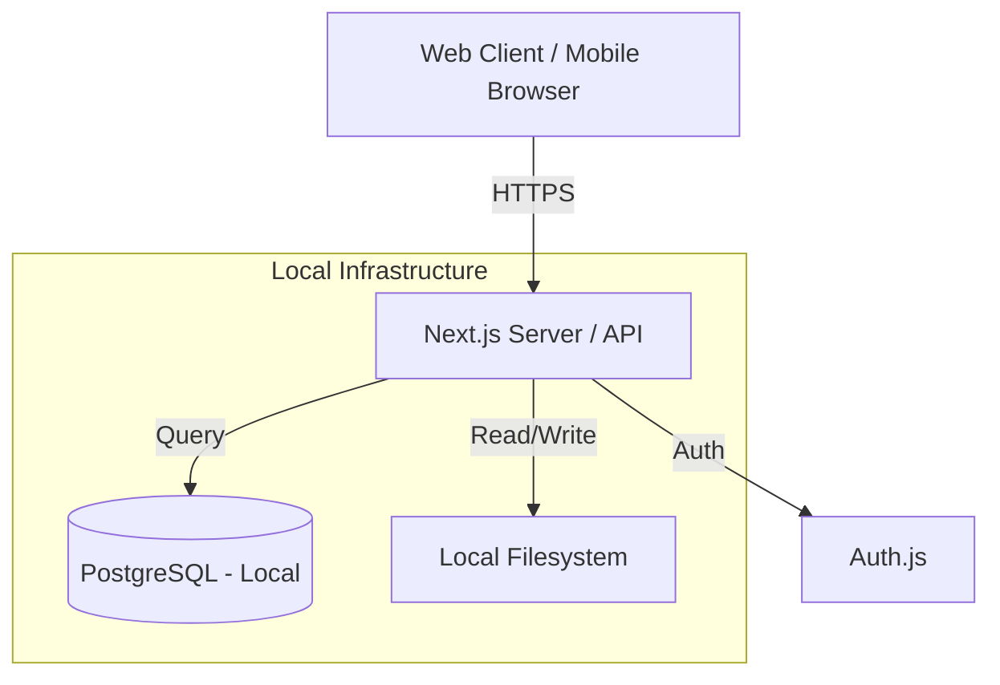

# Архитектура и Технологии - Warranty Manager

## 1. Технологичен Стек (Tech Stack)

За да постигнем "чист и модерен дизайн" и висока производителност, предлагам следния стек:

### Frontend & Backend (Fullstack Framework)
*   **Framework**: **Next.js 14+ (App Router)**.
    *   *Защо?* Осигурява отлична производителност (Server Components), SEO оптимизация, лесен деплоймънт и вграден API слой за backend логиката.
*   **Language**: **TypeScript**.
    *   *Защо?* Строга типизация за по-малко грешки и по-лесна поддръжка.

### UI & Design
*   **Styling**: **Tailwind CSS**.
    *   *Защо?* Бърза разработка, лесна персонализация, модерен вид.
*   **Components**: **Shadcn/ui** (върху Radix UI).
    *   *Защо?* Предоставя достъпни, красиви и напълно персонализируеми компоненти (Dialogs, Inputs, Cards), които изглеждат професионално "out of the box".
*   **Icons**: Lucide React.

### Database & Storage
*   **Database**: **PostgreSQL** (Local via Docker).
    *   *Защо?* Стандартна релационна база, лесна за пускане локално.
*   **ORM**: **Prisma**.
    *   *Защо?* Лесна работа с базата данни, миграции и type-safety.
*   **File Storage**: **Local Filesystem**.
    *   *Implementation*: Снимките ще се съхраняват в локална директория (напр. `./uploads` или volume в Docker) и ще се сервират през Next.js API route или public folder (ако е защитено, трябва API).

### Authentication
*   **Auth Library**: **Auth.js (NextAuth.js v5)**.
    *   *Providers*:
        *   Credentials (Email/Password).
        *   Google OAuth (Optional).
    *   *Защо?* Стандарт за Next.js, поддържа локални стратегии.

### AI Integration (FUTURE PHASE)
*   **Service**: **OpenAI GPT-4o-mini** (Vision) или **Google Gemini Flash**.
    *   *Status*: Deferred to Phase 2.

### Infrastructure & DevOps
*   **Hosting**: **Local / VPS**.
    *   Приложението ще се стартира чрез `docker-compose` или директно с `npm start` на локална машина/сървър.
*   **Containerization**: **Docker**.
    *   Ще подготвим `Dockerfile` и `docker-compose.yml` за лесно пускане на App + DB.

## 2. Архитектура на Приложението

### 2.1. High-Level Diagram


### 2.2. Папки и Структура (Next.js App Router)
```
/app
  /(auth)          # Login, Register pages
  /(dashboard)     # Protected routes
    /dashboard     # Main view
    /warranties    # List & Details
    /add           # Add new warranty flow
    /settings      # Account settings
    /admin         # Global Admin Panel
  /api             # API Routes (Webhooks, Uploads)
/components        # Reusable UI components
/lib               # Utility functions, DB client
/prisma            # Database schema
/uploads           # Local storage for images (gitignored)
```

## 3. Мобилна Версия
Приложението ще бъде **Responsive Web App (PWA)**.
*   Ще изглежда и работи като нативно приложение на телефон.
*   Ще може да се инсталира на началния екран.
