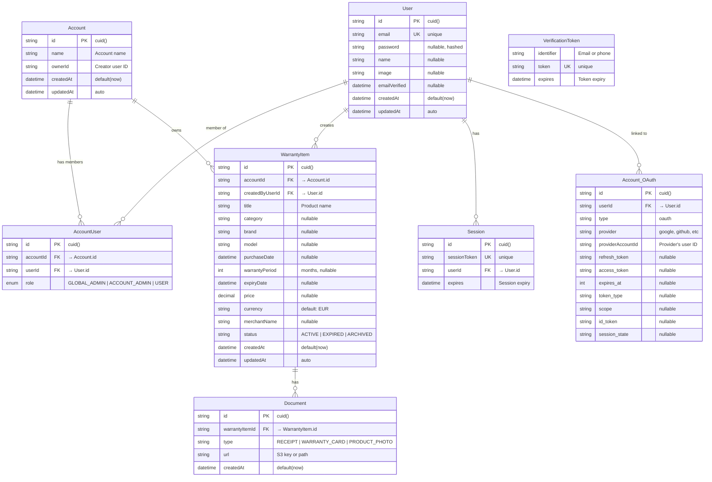
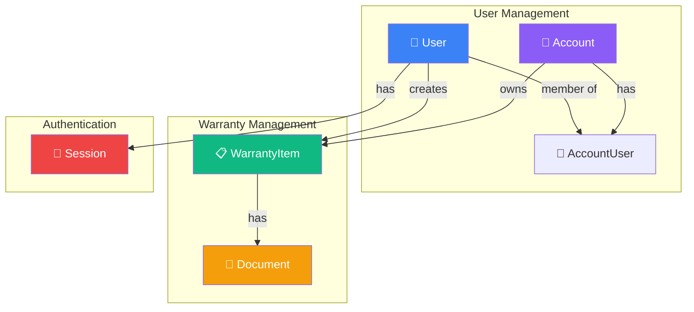
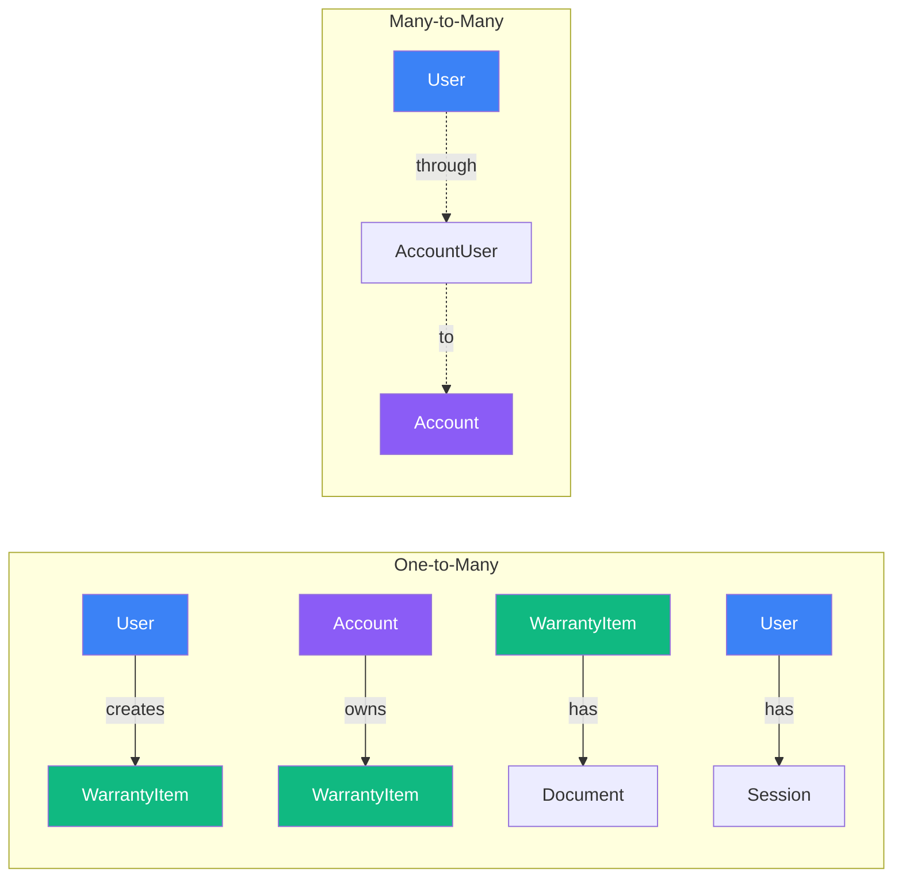

# База Данни - Warranty Manager

> Подробно описание на database schema и релациите  
> Актуализирано: 2025-11-22

## 📋 Съдържание
1. [Общ Преглед](#общ-преглед)
2. [Database Диаграма](#database-диаграма)
3. [Таблици](#таблици)
4. [Релации](#релации)
5. [Индекси и Ограничения](#индекси-и-ограничения)
6. [Примерни Заявки](#примерни-заявки)

---

## 🎯 Общ Преглед

### Технология
- **СУБД:** PostgreSQL 15
- **ORM:** Prisma 5.22.0
- **Миграции:** Prisma Migrate

### Структура
Базата данни съдържа **8 основни таблици**:

| Таблица | Предназначение | Тип |
|---------|----------------|-----|
| `User` | Потребители на системата | Core |
| `Account` | Акаунти/организации | Core |
| `AccountUser` | Връзка User ↔ Account с роли | Junction |
| `WarrantyItem` | Гаранционни карти | Core |
| `Document` | Прикачени файлове | Core |
| `Session` | Активни сесии (Auth.js) | Auth |
| `Account` (OAuth) | OAuth акаунти (Auth.js) | Auth |
| `VerificationToken` | Email verification tokens | Auth |

---

## 🗺 Database Диаграма

### Пълна ER Диаграма



### Опростена Диаграма (Core Tables)



---

## 📊 Таблици

### 1. User (Потребители)

**Предназначение:** Съхранява информация за всички потребители в системата.

| Колона | Тип | Описание | Constraints |
|--------|-----|----------|-------------|
| `id` | String | Уникален идентификатор | PRIMARY KEY, cuid() |
| `email` | String | Email адрес | UNIQUE, NOT NULL |
| `password` | String | Хеширана парола | NULLABLE (за OAuth users) |
| `name` | String | Име на потребителя | NULLABLE |
| `image` | String | URL на профилна снимка | NULLABLE |
| `emailVerified` | DateTime | Дата на верификация | NULLABLE |
| `createdAt` | DateTime | Дата на създаване | DEFAULT now() |
| `updatedAt` | DateTime | Последна промяна | AUTO UPDATE |

**Релации:**
- `accounts` → `AccountUser[]` (Many-to-Many)
- `createdWarranties` → `WarrantyItem[]` (One-to-Many)
- `sessions` → `Session[]` (One-to-Many)
- `accountsOAuth` → `Account[]` (One-to-Many, OAuth)

**Примерни данни:**
```sql
INSERT INTO "User" (id, email, password, name, createdAt, updatedAt)
VALUES (
  'clx123abc',
  'john@example.com',
  '$2a$10$hashed_password_here',
  'John Doe',
  NOW(),
  NOW()
);
```

---

### 2. Account (Акаунти/Организации)

**Предназначение:** Представлява акаунт (домакинство, фирма), който може да има множество потребители и гаранции.

| Колона | Тип | Описание | Constraints |
|--------|-----|----------|-------------|
| `id` | String | Уникален идентификатор | PRIMARY KEY, cuid() |
| `name` | String | Име на акаунта | NOT NULL |
| `ownerId` | String | ID на създателя | NOT NULL |
| `createdAt` | DateTime | Дата на създаване | DEFAULT now() |
| `updatedAt` | DateTime | Последна промяна | AUTO UPDATE |

**Релации:**
- `users` → `AccountUser[]` (Many-to-Many)
- `warranties` → `WarrantyItem[]` (One-to-Many)

**Бележки:**
- Таблицата `Account` се използва и за OAuth accounts (Auth.js)
- Има допълнителни колони за OAuth: `provider`, `providerAccountId`, `access_token`, и т.н.

**Примерни данни:**
```sql
INSERT INTO "Account" (id, name, ownerId, createdAt, updatedAt)
VALUES (
  'clx456def',
  'Семейство Иванови',
  'clx123abc',
  NOW(),
  NOW()
);
```

---

### 3. AccountUser (Връзка User ↔ Account)

**Предназначение:** Junction table за Many-to-Many връзка между User и Account, с допълнително поле за роля.

| Колона | Тип | Описание | Constraints |
|--------|-----|----------|-------------|
| `id` | String | Уникален идентификатор | PRIMARY KEY, cuid() |
| `accountId` | String | ID на акаунта | FOREIGN KEY → Account.id |
| `userId` | String | ID на потребителя | FOREIGN KEY → User.id |
| `role` | Enum | Роля в акаунта | DEFAULT 'USER' |

**Enum: Role**
```typescript
enum Role {
  GLOBAL_ADMIN    // Системен администратор
  ACCOUNT_ADMIN   // Администратор на акаунта
  USER            // Обикновен потребител
}
```

**Constraints:**
- `UNIQUE(accountId, userId)` - Един потребител може да е член само веднъж в акаунт
- `ON DELETE CASCADE` - При изтриване на Account или User, записът се изтрива

**Примерни данни:**
```sql
INSERT INTO "AccountUser" (id, accountId, userId, role)
VALUES (
  'clx789ghi',
  'clx456def',
  'clx123abc',
  'ACCOUNT_ADMIN'
);
```

---

### 4. WarrantyItem (Гаранционни Карти)

**Предназначение:** Съхранява информация за продукти с гаранция.

| Колона | Тип | Описание | Constraints |
|--------|-----|----------|-------------|
| `id` | String | Уникален идентификатор | PRIMARY KEY, cuid() |
| `accountId` | String | ID на акаунта | FOREIGN KEY → Account.id |
| `createdByUserId` | String | ID на създателя | FOREIGN KEY → User.id |
| `title` | String | Име на продукта | NOT NULL |
| `category` | String | Категория (Електроника, и т.н.) | NULLABLE |
| `brand` | String | Марка | NULLABLE |
| `model` | String | Модел | NULLABLE |
| `purchaseDate` | DateTime | Дата на покупка | NULLABLE |
| `warrantyPeriod` | Int | Период на гаранция (месеци) | NULLABLE |
| `expiryDate` | DateTime | Дата на изтичане | NULLABLE |
| `price` | Decimal | Цена | NULLABLE |
| `currency` | String | Валута | DEFAULT 'EUR' |
| `merchantName` | String | Име на търговеца | NULLABLE |
| `status` | String | Статус | DEFAULT 'ACTIVE' |
| `createdAt` | DateTime | Дата на създаване | DEFAULT now() |
| `updatedAt` | DateTime | Последна промяна | AUTO UPDATE |

**Статуси:**
- `ACTIVE` - Активна гаранция
- `EXPIRED` - Изтекла гаранция
- `ARCHIVED` - Архивирана

**Релации:**
- `account` → `Account` (Many-to-One)
- `createdBy` → `User` (Many-to-One)
- `documents` → `Document[]` (One-to-Many)

**Constraints:**
- `ON DELETE CASCADE` - При изтриване на Account, всички гаранции се изтриват

**Примерни данни:**
```sql
INSERT INTO "WarrantyItem" (
  id, accountId, createdByUserId, title, category, brand,
  purchaseDate, warrantyPeriod, expiryDate, price, currency,
  status, createdAt, updatedAt
)
VALUES (
  'clxabc123',
  'clx456def',
  'clx123abc',
  'MacBook Pro 16"',
  'Електроника',
  'Apple',
  '2024-01-15',
  24,
  '2026-01-15',
  2999.00,
  'EUR',
  'ACTIVE',
  NOW(),
  NOW()
);
```

---

### 5. Document (Документи)

**Предназначение:** Съхранява прикачени файлове към гаранционни карти.

| Колона | Тип | Описание | Constraints |
|--------|-----|----------|-------------|
| `id` | String | Уникален идентификатор | PRIMARY KEY, cuid() |
| `warrantyItemId` | String | ID на гаранцията | FOREIGN KEY → WarrantyItem.id |
| `type` | String | Тип на документа | NOT NULL |
| `url` | String | S3 key или път | NOT NULL |
| `createdAt` | DateTime | Дата на качване | DEFAULT now() |

**Типове документи:**
- `RECEIPT` - Касова бележка / Фактура
- `WARRANTY_CARD` - Гаранционна карта
- `PRODUCT_PHOTO` - Снимка на продукта

**Релации:**
- `warrantyItem` → `WarrantyItem` (Many-to-One)

**Constraints:**
- `ON DELETE CASCADE` - При изтриване на WarrantyItem, всички документи се изтриват

**Примерни данни:**
```sql
INSERT INTO "Document" (id, warrantyItemId, type, url, createdAt)
VALUES 
  ('clxdoc001', 'clxabc123', 'RECEIPT', 'documents/uuid-receipt.jpg', NOW()),
  ('clxdoc002', 'clxabc123', 'WARRANTY_CARD', 'documents/uuid-warranty.pdf', NOW()),
  ('clxdoc003', 'clxabc123', 'PRODUCT_PHOTO', 'documents/uuid-photo.jpg', NOW());
```

---

### 6. Session (Сесии)

**Предназначение:** Съхранява активни потребителски сесии (Auth.js).

| Колона | Тип | Описание | Constraints |
|--------|-----|----------|-------------|
| `id` | String | Уникален идентификатор | PRIMARY KEY, cuid() |
| `sessionToken` | String | Session token | UNIQUE, NOT NULL |
| `userId` | String | ID на потребителя | FOREIGN KEY → User.id |
| `expires` | DateTime | Дата на изтичане | NOT NULL |

**Релации:**
- `user` → `User` (Many-to-One)

**Constraints:**
- `ON DELETE CASCADE` - При изтриване на User, всички сесии се изтриват

---

### 7. Account (OAuth) - Допълнителни Колони

**Предназначение:** Съхранява OAuth account информация (Google, GitHub, и т.н.).

Таблицата `Account` има допълнителни колони за OAuth:

| Колона | Тип | Описание |
|--------|-----|----------|
| `userId` | String | ID на User |
| `type` | String | "oauth" |
| `provider` | String | "google", "github", и т.н. |
| `providerAccountId` | String | ID от provider |
| `refresh_token` | String | Refresh token |
| `access_token` | String | Access token |
| `expires_at` | Int | Token expiry timestamp |
| `token_type` | String | "Bearer", и т.н. |
| `scope` | String | OAuth scopes |
| `id_token` | String | ID token (OpenID) |
| `session_state` | String | Session state |

**Constraints:**
- `UNIQUE(provider, providerAccountId)` - Един OAuth account може да е свързан само веднъж

---

### 8. VerificationToken (Verification Tokens)

**Предназначение:** Съхранява tokens за email verification.

| Колона | Тип | Описание | Constraints |
|--------|-----|----------|-------------|
| `identifier` | String | Email или телефон | NOT NULL |
| `token` | String | Verification token | UNIQUE, NOT NULL |
| `expires` | DateTime | Дата на изтичане | NOT NULL |

**Constraints:**
- `UNIQUE(identifier, token)` - Комбинацията е уникална

---

## 🔗 Релации

### Визуализация на Релациите



### Детайлно Описание

#### 1. User ↔ Account (Many-to-Many)

**Релация:** Един потребител може да е член на множество акаунти, и един акаунт може да има множество потребители.

**Junction Table:** `AccountUser`

**Prisma Schema:**
```prisma
model User {
  accounts AccountUser[]
}

model Account {
  users AccountUser[]
}

model AccountUser {
  id        String  @id @default(cuid())
  accountId String
  userId    String
  role      Role    @default(USER)
  
  account   Account @relation(fields: [accountId], references: [id], onDelete: Cascade)
  user      User    @relation(fields: [userId], references: [id], onDelete: Cascade)
  
  @@unique([accountId, userId])
}
```

**Примерна Заявка:**
```typescript
// Намери всички акаунти на потребител
const userAccounts = await prisma.accountUser.findMany({
  where: { userId: 'user_123' },
  include: { account: true }
})

// Намери всички потребители в акаунт
const accountUsers = await prisma.accountUser.findMany({
  where: { accountId: 'acc_456' },
  include: { user: true }
})
```

---

#### 2. User → WarrantyItem (One-to-Many)

**Релация:** Един потребител може да създаде множество гаранции.

**Prisma Schema:**
```prisma
model User {
  createdWarranties WarrantyItem[]
}

model WarrantyItem {
  createdByUserId String
  createdBy       User   @relation(fields: [createdByUserId], references: [id])
}
```

**Примерна Заявка:**
```typescript
// Намери всички гаранции, създадени от потребител
const warranties = await prisma.warrantyItem.findMany({
  where: { createdByUserId: 'user_123' }
})
```

---

#### 3. Account → WarrantyItem (One-to-Many)

**Релация:** Един акаунт може да притежава множество гаранции.

**Prisma Schema:**
```prisma
model Account {
  warranties WarrantyItem[]
}

model WarrantyItem {
  accountId String
  account   Account @relation(fields: [accountId], references: [id], onDelete: Cascade)
}
```

**Примерна Заявка:**
```typescript
// Намери всички гаранции в акаунт
const warranties = await prisma.warrantyItem.findMany({
  where: { accountId: 'acc_456' },
  include: { documents: true }
})
```

---

#### 4. WarrantyItem → Document (One-to-Many)

**Релация:** Една гаранция може да има множество документи.

**Prisma Schema:**
```prisma
model WarrantyItem {
  documents Document[]
}

model Document {
  warrantyItemId String
  warrantyItem   WarrantyItem @relation(fields: [warrantyItemId], references: [id], onDelete: Cascade)
}
```

**Примерна Заявка:**
```typescript
// Намери всички документи на гаранция
const documents = await prisma.document.findMany({
  where: { warrantyItemId: 'warranty_789' }
})

// Намери гаранция с документи
const warranty = await prisma.warrantyItem.findUnique({
  where: { id: 'warranty_789' },
  include: { documents: true }
})
```

---

#### 5. User → Session (One-to-Many)

**Релация:** Един потребител може да има множество активни сесии.

**Prisma Schema:**
```prisma
model User {
  sessions Session[]
}

model Session {
  userId String
  user   User   @relation(fields: [userId], references: [id], onDelete: Cascade)
}
```

---

## 🔍 Индекси и Ограничения

### Primary Keys
Всички таблици използват `cuid()` за генериране на уникални ID-та.

```prisma
@id @default(cuid())
```

### Unique Constraints

| Таблица | Колона(и) | Описание |
|---------|-----------|----------|
| `User` | `email` | Email адресът е уникален |
| `Session` | `sessionToken` | Session token е уникален |
| `AccountUser` | `accountId, userId` | Един потребител може да е член само веднъж |
| `Account` (OAuth) | `provider, providerAccountId` | OAuth account е уникален |
| `VerificationToken` | `token` | Token е уникален |
| `VerificationToken` | `identifier, token` | Комбинацията е уникална |

### Foreign Keys с Cascade Delete

```prisma
// При изтриване на Account, всички AccountUser записи се изтриват
account Account @relation(fields: [accountId], references: [id], onDelete: Cascade)

// При изтриване на WarrantyItem, всички Document записи се изтриват
warrantyItem WarrantyItem @relation(fields: [warrantyItemId], references: [id], onDelete: Cascade)
```

### Индекси за Performance

Prisma автоматично създава индекси за:
- Primary keys
- Unique constraints
- Foreign keys

**Допълнителни индекси (ако е необходимо):**
```prisma
model WarrantyItem {
  @@index([accountId, status])  // За филтриране по акаунт и статус
  @@index([expiryDate])          // За намиране на изтичащи гаранции
}
```

---

## 📝 Примерни Заявки

### 1. Създаване на Потребител с Акаунт

```typescript
const user = await prisma.user.create({
  data: {
    email: 'john@example.com',
    password: await bcrypt.hash('password123', 10),
    name: 'John Doe',
    accounts: {
      create: {
        account: {
          create: {
            name: 'Семейство Doe',
            ownerId: 'will-be-set-after-creation'
          }
        },
        role: 'ACCOUNT_ADMIN'
      }
    }
  }
})
```

### 2. Добавяне на Гаранция с Документи

```typescript
const warranty = await prisma.warrantyItem.create({
  data: {
    title: 'iPhone 15 Pro',
    category: 'Електроника',
    brand: 'Apple',
    purchaseDate: new Date('2024-09-15'),
    warrantyPeriod: 12,
    expiryDate: new Date('2025-09-15'),
    price: 1299,
    currency: 'EUR',
    status: 'ACTIVE',
    accountId: 'acc_123',
    createdByUserId: 'user_456',
    documents: {
      create: [
        {
          type: 'RECEIPT',
          url: 'documents/uuid-receipt.jpg'
        },
        {
          type: 'WARRANTY_CARD',
          url: 'documents/uuid-warranty.pdf'
        }
      ]
    }
  },
  include: {
    documents: true
  }
})
```

### 3. Намиране на Изтичащи Гаранции

```typescript
const expiringWarranties = await prisma.warrantyItem.findMany({
  where: {
    accountId: 'acc_123',
    status: 'ACTIVE',
    expiryDate: {
      gte: new Date(),
      lte: new Date(Date.now() + 30 * 24 * 60 * 60 * 1000) // 30 дни
    }
  },
  include: {
    documents: true,
    createdBy: {
      select: {
        name: true,
        email: true
      }
    }
  },
  orderBy: {
    expiryDate: 'asc'
  }
})
```

### 4. Проверка на Права на Потребител

```typescript
const hasAccess = await prisma.accountUser.findFirst({
  where: {
    userId: 'user_123',
    accountId: 'acc_456',
    role: {
      in: ['ACCOUNT_ADMIN', 'GLOBAL_ADMIN']
    }
  }
})

if (!hasAccess) {
  throw new Error('Unauthorized')
}
```

### 5. Статистика за Акаунт

```typescript
const stats = await prisma.account.findUnique({
  where: { id: 'acc_123' },
  include: {
    _count: {
      select: {
        warranties: true,
        users: true
      }
    },
    warranties: {
      where: { status: 'ACTIVE' },
      select: {
        price: true,
        currency: true
      }
    }
  }
})

// Изчисляване на обща стойност
const totalValue = stats.warranties.reduce((sum, w) => sum + (w.price || 0), 0)
```

### 6. Търсене на Гаранции

```typescript
const results = await prisma.warrantyItem.findMany({
  where: {
    accountId: 'acc_123',
    OR: [
      { title: { contains: searchQuery, mode: 'insensitive' } },
      { brand: { contains: searchQuery, mode: 'insensitive' } },
      { category: { contains: searchQuery, mode: 'insensitive' } }
    ]
  },
  include: {
    documents: {
      where: { type: 'PRODUCT_PHOTO' },
      take: 1
    }
  }
})
```

### 7. Изтриване на Гаранция (Cascade)

```typescript
// Изтрива WarrantyItem и автоматично всички свързани Document записи
await prisma.warrantyItem.delete({
  where: { id: 'warranty_789' }
})
```

---

## 🛠 Миграции

### Създаване на Миграция

```bash
npx prisma migrate dev --name add_warranty_status
```

### Прилагане на Миграции (Production)

```bash
npx prisma migrate deploy
```

### Reset на База Данни (Development)

```bash
npx prisma migrate reset
```

### Генериране на Prisma Client

```bash
npx prisma generate
```

---

## 📊 Database Size Estimations

### Приблизителни Размери

| Таблица | Записи (1 година) | Размер на запис | Общ размер |
|---------|-------------------|-----------------|------------|
| `User` | 1,000 | ~500 bytes | ~500 KB |
| `Account` | 500 | ~300 bytes | ~150 KB |
| `AccountUser` | 1,500 | ~200 bytes | ~300 KB |
| `WarrantyItem` | 10,000 | ~800 bytes | ~8 MB |
| `Document` | 30,000 | ~300 bytes | ~9 MB |
| `Session` | 2,000 | ~400 bytes | ~800 KB |

**Общо:** ~19 MB (без файловете в MinIO)

---

## 🔮 Бъдещи Подобрения

### Планирани Промени

1. **Full-text Search Index**
   ```prisma
   @@index([title, brand, category], type: GIN)
   ```

2. **Audit Log Table**
   ```prisma
   model AuditLog {
     id        String   @id @default(cuid())
     userId    String
     action    String   // CREATE, UPDATE, DELETE
     entity    String   // WarrantyItem, Account, etc.
     entityId  String
     changes   Json
     createdAt DateTime @default(now())
   }
   ```

3. **Notification Table**
   ```prisma
   model Notification {
     id             String   @id @default(cuid())
     userId         String
     warrantyItemId String
     type           String   // EXPIRING_SOON, EXPIRED
     sentAt         DateTime?
     createdAt      DateTime @default(now())
   }
   ```

4. **Soft Deletes**
   ```prisma
   model WarrantyItem {
     deletedAt DateTime?
     
     @@index([deletedAt])
   }
   ```

---

**Документ създаден:** 2025-11-22  
**Версия:** 1.0  
**Автор:** Development Team
